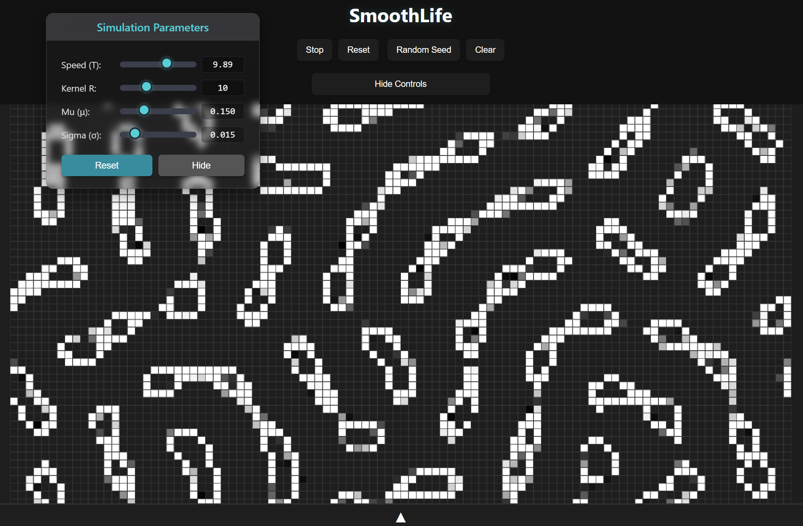

# SmoothLife

A web-based implementation of **SmoothLife**, a continuous cellular automaton.  
Explore evolving, fluid-like patterns in your browser with interactive controls and customizable parameters.

**Live Demo:** [https://shahryarfp.github.io/Smooth-Life/](https://shahryarfp.github.io/Smooth-Life/)

## What Is SmoothLife?

SmoothLife is a continuous-valued extension of Conway’s Game of Life. Instead of cells being simply “on” or “off,” each cell holds a value between fully dead and fully alive. Over time, these values evolve according to a smooth, neighborhood-based growth rule, producing fluid, organic patterns that flow and merge in ways not possible with the classic binary version.

## How It Works

1. **Continuous States**  
   Each cell’s state is a number between 0 (dead) and 1 (alive). This allows partial life-values and smooth gradients across the grid.

2. **Neighborhood Averaging**  
   Every cell looks at its surrounding neighborhood and computes a weighted average of their states. Closer neighbors have more influence, creating a softly blended field.

3. **Smooth Growth Rule**  
   Rather than hard birth/survival thresholds, SmoothLife applies a gently sloping “growth curve” to the averaged density:
   - If the local average is below a lower bound, the cell gradually dies back.
   - If it lies within a narrow “birth band,” the cell strengthens toward life.
   - Above a higher bound, the cell again diminishes.
   This produces ever-shifting rings, gliders, and waves that flow like liquid.

4. **Fluid-Like Behavior**  
   Because changes are gradual and neighborhood weights blend smoothly, you’ll see spirals dissolve into waves, gliders fragment into ripples, and cells ebb and flow rather than flick on and off.

5. **Interactive Parameters**  
   You can adjust:
   - **Interaction radius** (how far a cell “sees” its neighbors)  
   - **Birth/survival bands** (the inner and outer density ranges that promote growth or decay)  
   - **Evolution speed** (how quickly values update)  
